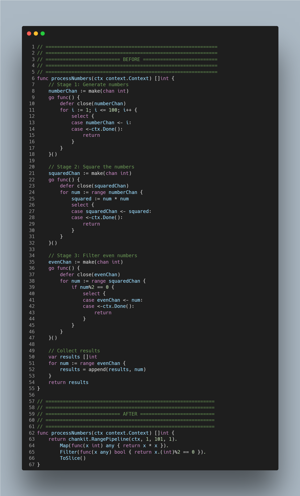
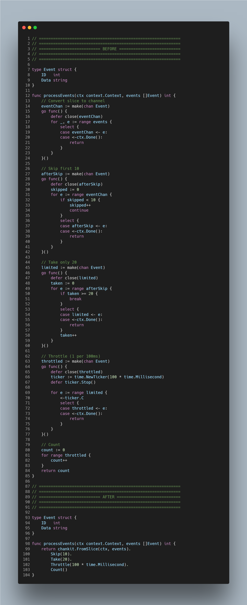
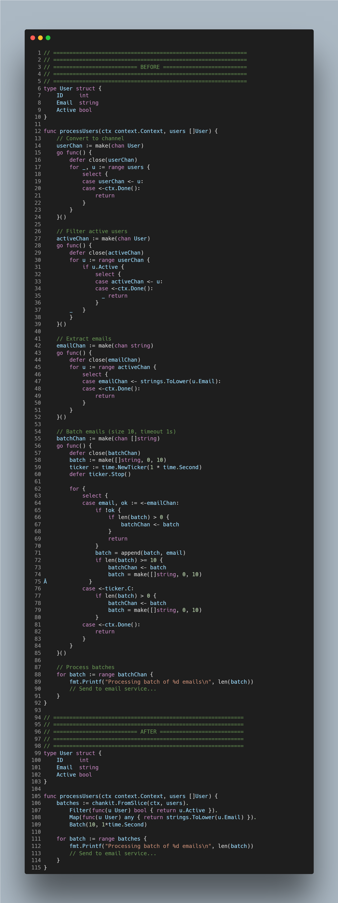
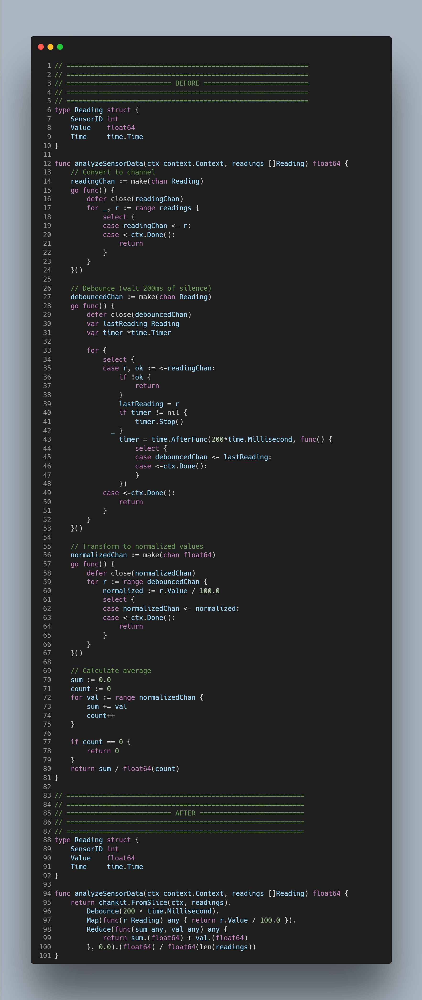

# chankit

A comprehensive Go toolkit for elegant and powerful channel operations. Built with generics for type safety and composability.

<!-- Examples Section -->

<div align="center" style="margin-bottom: 2em;">
  <h3 style="
    font-size:2rem;
    margin:0.8em 0 0.3em 0;
    letter-spacing:0.01em;
    color:#334085;"
  >✨ Example 1: Data Processing Pipeline</h3>
  <p style="
    font-size:1.08rem;
    color:#556;"
  >
    <b>Goal:</b> Take numbers <b>1–100</b>, square them, keep only the <b>even</b> results, and collect all outputs.
  </p>
  
</div>

---

<div align="center" style="margin-bottom: 2em;">
  <h3 style="
    font-size:2rem;
    margin:0.8em 0 0.3em 0;
    letter-spacing:0.01em;
    color:#334085;"
  >✨ Example 2: Event Stream Processing</h3>
  <p style="
    font-size:1.08rem;
    color:#556;"
  >
    <b>Goal:</b> Process event stream &mdash; skip first <b>10</b>, take next <b>20</b>, throttle, then count.
  </p>
  
</div>

---

<div align="center" style="margin-bottom: 2em;">
  <h3 style="
    font-size:2rem;
    margin:0.8em 0 0.3em 0;
    letter-spacing:0.01em;
    color:#334085;"
  >✨ Example 3: Data Transformation Stream</h3>
  <p style="
    font-size:1.08rem;
    color:#556;"
  >
    <b>Goal:</b> Transform user data &mdash; filter <b>active users</b>, extract <b>emails</b>, batch and process.
  </p>
  
</div>

---

<div align="center" style="margin-bottom: 2em;">
  <h3 style="
    font-size:2rem;
    margin:0.8em 0 0.3em 0;
    letter-spacing:0.01em;
    color:#334085;"
  >✨ Example 4: Real-time Data Analytics</h3>
  <p style="
    font-size:1.08rem;
    color:#556;"
  >
    <b>Goal:</b> Process sensor data &mdash; <b>debounce</b> readings, <b>transform</b>, reduce to <b>average</b>.
  </p>
  
</div>

## Features

- **Flow Control**: Throttle, debounce, batch, and fixed-interval processing
- **Transformations**: Map, filter, and reduce operations on channels
- **Generators**: Create channels from functions, ranges, and repeated values
- **Conversions**: Seamless slice-to-channel and channel-to-slice conversions
- **Context-Aware**: All operations respect context cancellation
- **Type-Safe**: Full generic support for compile-time type safety
- **Production-Ready**: Comprehensive test coverage

## Installation

```bash
go get github.com/utkarsh5026/chankit
```

## Quick Start

### Traditional Approach (Function Chaining)

```go
import (
    "context"
    "fmt"
    "time"
    "github.com/utkarsh5026/chankit/chankit"
)

func main() {
    ctx := context.Background()

    // Create a range of numbers
    numbers := chankit.Range(ctx, 1, 10, 1)

    // Transform with Map
    doubled := chankit.Map(ctx, numbers, func(x int) int {
        return x * 2
    })

    // Filter even numbers
    evens := chankit.Filter(ctx, doubled, func(x int) bool {
        return x%4 == 0
    })

    // Collect to slice
    result := chankit.ChanToSlice(ctx, evens)
    fmt.Println(result) // [4, 8, 12, 16]
}
```

### Modern Pipeline Approach (NEW! ⭐)

```go
import (
    "context"
    "fmt"
    "github.com/utkarsh5026/chankit/chankit"
)

func main() {
    ctx := context.Background()

    // Same logic, much cleaner syntax with Pipeline API
    result := chankit.RangePipeline(ctx, 1, 10, 1).
        Map(func(x int) any { return x * 2 }).
        Filter(func(x any) bool { return x.(int)%4 == 0 }).
        ToSlice()

    fmt.Println(result) // [4, 8, 12, 16]
}
```

## API Reference

### 🚀 Pipeline API (Fluent Interface)

The Pipeline API provides a modern, chainable interface for channel operations, making your code more readable and maintainable.

#### Creating Pipelines

```go
// From a range of numbers
pipeline := chankit.RangePipeline(ctx, 1, 100, 1)

// From an existing slice
pipeline := chankit.FromSlice(ctx, []int{1, 2, 3, 4, 5})

// From an existing channel
pipeline := chankit.From(ctx, myChan)

// Generate values
pipeline := chankit.NewPipeline[int](ctx).Generate(func() (int, bool) {
    return getValue(), hasMore()
})

// Repeat a value
pipeline := chankit.NewPipeline[string](ctx).Repeat("ping").Take(10)
```

#### Transformation Methods

```go
// Map: Transform each value
pipeline.Map(func(x int) any { return x * 2 })

// MapTo: Type-safe transformation (recommended)
chankit.MapTo(pipeline, func(x int) string { return fmt.Sprint(x) })

// Filter: Keep only matching values
pipeline.Filter(func(x int) bool { return x > 10 })

// Where: Alias for Filter (LINQ-style)
pipeline.Where(func(x int) bool { return x%2 == 0 })

// Select: Alias for Map (LINQ-style)
pipeline.Select(func(x int) any { return x * 2 })

// FlatMap: Transform and flatten
pipeline.FlatMap(func(x int) <-chan int {
    ch := make(chan int, 2)
    go func() {
        defer close(ch)
        ch <- x
        ch <- x * 10
    }()
    return ch
})
```

#### Selection Methods

```go
// Take: Get first N values
pipeline.Take(10)

// Skip: Skip first N values
pipeline.Skip(5)

// TakeWhile: Take while predicate is true
pipeline.TakeWhile(func(x int) bool { return x < 100 })

// SkipWhile: Skip while predicate is true
pipeline.SkipWhile(func(x int) bool { return x < 0 })

// First: Get first value
value, ok := pipeline.First()

// Last: Get last value
value, ok := pipeline.Last()
```

#### Flow Control Methods

```go
// Throttle: Rate limit (drops values)
pipeline.Throttle(100 * time.Millisecond)

// Debounce: Wait for silence
pipeline.Debounce(300 * time.Millisecond)

// FixedInterval: Pace values (preserves all)
pipeline.FixedInterval(100 * time.Millisecond)

// Batch: Group into batches
batches := pipeline.Batch(10, 1*time.Second)
for batch := range batches {
    fmt.Printf("Got %d items\n", len(batch))
}
```

#### Side Effects & Observation

```go
// Tap: Observe values without modifying
pipeline.Tap(func(x int) {
    fmt.Printf("Processing: %d\n", x)
})

// ForEach: Execute for each value (terminal)
pipeline.ForEach(func(x int) {
    fmt.Println(x)
})
```

#### Combining Pipelines

```go
// Merge: Combine multiple channels
ch1 := chankit.RangePipeline(ctx, 1, 5, 1)
ch2 := chankit.RangePipeline(ctx, 10, 15, 1)
merged := ch1.Merge(ch2.Chan())

// ZipWith: Pair values from two channels
numbers := chankit.RangePipeline(ctx, 1, 5, 1)
letters := chankit.FromSlice(ctx, []string{"a", "b", "c", "d"})
pairs := chankit.ZipWith(numbers, letters.Chan())
```

#### Terminal Operations

```go
// ToSlice: Collect all values
result := pipeline.ToSlice()

// Reduce: Aggregate values
sum := pipeline.Reduce(func(acc, x int) int { return acc + x }, 0)

// ReduceTo: Reduce with type change
str := chankit.ReduceTo(pipeline, func(acc string, x int) string {
    return acc + fmt.Sprint(x)
}, "")

// Count: Count values
count := pipeline.Count()

// Any: Check if any value matches
hasEven := pipeline.Any(func(x int) bool { return x%2 == 0 })

// All: Check if all values match
allPositive := pipeline.All(func(x int) bool { return x > 0 })

// Chan: Get underlying channel
ch := pipeline.Chan()
for val := range ch {
    // process val
}
```

#### Complete Pipeline Example

```go
ctx := context.Background()

// Complex data processing pipeline
result := chankit.RangePipeline(ctx, 1, 1000, 1).
    Filter(func(x int) bool { return x%2 == 0 }).    // Even numbers only
    Map(func(x int) any { return x * x }).           // Square them
    Tap(func(x any) { log.Printf("Value: %v", x) }). // Log each value
    Skip(10).                                         // Skip first 10
    Take(20).                                         // Take next 20
    ToSlice()                                         // Collect results

fmt.Printf("Processed %d values\n", len(result))
```

### Flow Control

#### Throttle

Limits the rate of values by emitting only the most recent value within each time interval. Intermediate values are dropped.

```go
// Rate limit to 1 value per 100ms (drops intermediate values)
throttled := chankit.Throttle(ctx, input, 100*time.Millisecond)

// With buffered output
throttled := chankit.Throttle(ctx, input, 100*time.Millisecond,
    chankit.WithBuffer[int](10))
```

**Use Cases**: UI updates, high-frequency event handling, reducing API call frequency

#### Debounce

Emits values only after a period of silence. Timer resets on each new value. Perfect for handling bursts where only the final value matters.

```go
// Wait 200ms of silence before emitting
debounced := chankit.Debounce(ctx, input, 200*time.Millisecond)

// Search box example
searchResults := chankit.Debounce(ctx, userInput, 300*time.Millisecond)
```

**Use Cases**: Search boxes, form validation, resize events, scroll handling

**Key Difference from Throttle**:

- **Throttle**: Emits at fixed intervals (e.g., every 100ms)
- **Debounce**: Waits for silence before emitting (e.g., 100ms after last input)

#### FixedInterval

Processes every value at a fixed rate. Unlike Throttle, no values are dropped - they're queued and emitted with consistent spacing.

```go
// Emit one value every 100ms (all values preserved)
paced := chankit.FixedInterval(ctx, input, 100*time.Millisecond)
```

**Use Cases**: Rate-limited API calls, paced downloads, consistent processing rate

#### Batch

Groups values into batches based on size or timeout, whichever comes first.

```go
// Batch by size (3 items) or timeout (100ms)
batches := chankit.Batch(ctx, input, 3, 100*time.Millisecond)

// Process batches
for batch := range batches {
    fmt.Printf("Processing %d items\n", len(batch))
    // Process batch...
}
```

**Use Cases**: Bulk database inserts, batch API requests, log aggregation

### Transformations

#### Map

Transforms each value using a function. Can change the type.

```go
// Double values
doubled := chankit.Map(ctx, numbers, func(x int) int {
    return x * 2
})

// Convert types
strings := chankit.Map(ctx, numbers, func(x int) string {
    return fmt.Sprintf("num_%d", x)
})
```

#### Filter

Emits only values that satisfy a predicate.

```go
// Even numbers only
evens := chankit.Filter(ctx, numbers, func(x int) bool {
    return x%2 == 0
})

// Positive numbers
positive := chankit.Filter(ctx, numbers, func(x int) bool {
    return x > 0
})
```

#### Reduce

Aggregates all values into a single result. This is a blocking operation.

```go
// Sum all values
sum := chankit.Reduce(ctx, numbers, func(acc, x int) int {
    return acc + x
}, 0)

// Find maximum
max := chankit.Reduce(ctx, numbers, func(max, x int) int {
    if x > max {
        return x
    }
    return max
}, 0)

// Concatenate strings
result := chankit.Reduce(ctx, words, func(acc, word string) string {
    return acc + " " + word
}, "")
```

### Generators

#### Generate

Creates a channel from a generator function.

```go
// Fibonacci sequence
fib := chankit.Generate(ctx, func() (int, bool) {
    // Return (value, true) to emit, or (zero, false) to stop
    val := computeNext()
    return val, val < 1000
})

// With buffering
buffered := chankit.Generate(ctx, genFunc, chankit.WithBuffer[int](10))
```

#### Repeat

Infinitely repeats a value until context is cancelled.

```go
// Repeat "ping" forever
pings := chankit.Repeat(ctx, "ping")

// Use with context timeout
ctx, cancel := context.WithTimeout(context.Background(), 5*time.Second)
defer cancel()
heartbeats := chankit.Repeat(ctx, "heartbeat")
```

#### Range

Generates a sequence of numbers.

```go
// 0 to 9
range1 := chankit.Range(ctx, 0, 10, 1)

// Countdown: 10 to 1
countdown := chankit.Range(ctx, 10, 0, -1)

// Even numbers: 0, 2, 4, 6, 8
evens := chankit.Range(ctx, 0, 10, 2)

// Works with float64
decimals := chankit.Range(ctx, 0.0, 1.0, 0.1)
```

### Conversions

#### SliceToChan

Converts a slice to a channel.

```go
slice := []int{1, 2, 3, 4, 5}

// Unbuffered
ch := chankit.SliceToChan(ctx, slice)

// Buffered with custom size
ch := chankit.SliceToChan(ctx, slice, chankit.WithBuffer[int](10))

// Auto-sized buffer (matches slice length)
ch := chankit.SliceToChan(ctx, slice, chankit.WithBufferAuto[int]())
```

#### ChanToSlice

Collects all values from a channel into a slice. Blocks until channel closes.

```go
// Default capacity
slice := chankit.ChanToSlice(ctx, ch)

// Pre-allocate for better performance
slice := chankit.ChanToSlice(ctx, ch, chankit.WithCapacity[int](100))
```

## Configuration Options

### Channel Buffering

Control output channel buffer sizes for better performance:

```go
// Unbuffered (default)
ch := chankit.Map(ctx, input, fn)

// Custom buffer size
ch := chankit.Map(ctx, input, fn, chankit.WithBuffer[int](50))

// Auto-sized (for SliceToChan only)
ch := chankit.SliceToChan(ctx, slice, chankit.WithBufferAuto[int]())
```

### Slice Pre-allocation

Optimize memory allocation when collecting channels:

```go
// Default (zero capacity)
slice := chankit.ChanToSlice(ctx, ch)

// Pre-allocate if you know approximate size
slice := chankit.ChanToSlice(ctx, ch, chankit.WithCapacity[int](1000))
```

## Patterns and Examples

### Pipeline Pattern

#### Traditional Function Chaining vs. Modern Pipeline API

```go
ctx := context.Background()

// ❌ Old way: Deeply nested, hard to read
result := chankit.ChanToSlice(ctx,
    chankit.Filter(ctx,
        chankit.Map(ctx,
            chankit.Range(ctx, 1, 100, 1),
            func(x int) int { return x * x },
        ),
        func(x int) bool { return x%2 == 0 },
    ),
)

// ✅ New way: Clean, readable, maintainable
result := chankit.RangePipeline(ctx, 1, 100, 1).
    Map(func(x int) any { return x * x }).
    Filter(func(x any) bool { return x.(int)%2 == 0 }).
    ToSlice()
```

### Debounced Search

Implement efficient search-as-you-type:

```go
// Traditional approach
func handleSearch(ctx context.Context, userInput <-chan string) <-chan []Result {
    debounced := chankit.Debounce(ctx, userInput, 300*time.Millisecond)
    return chankit.Map(ctx, debounced, func(query string) []Result {
        return performSearch(query)
    })
}

// Pipeline approach
func handleSearchPipeline(ctx context.Context, userInput <-chan string) <-chan any {
    return chankit.From(ctx, userInput).
        Debounce(300*time.Millisecond).
        Map(func(query string) any { return performSearch(query) }).
        Chan()
}
```

### Rate-Limited API Calls

Process items with rate limiting:

```go
func processItems(ctx context.Context, items []Item) {
    // Convert to channel
    itemChan := chankit.SliceToChan(ctx, items)

    // Process at most 10 items per second
    paced := chankit.FixedInterval(ctx, itemChan, 100*time.Millisecond)

    // Make API calls
    for item := range paced {
        apiClient.Process(item)
    }
}
```

### Batch Processing

Efficiently batch database operations:

```go
func saveRecords(ctx context.Context, records <-chan Record) {
    // Batch 100 records or every 5 seconds
    batches := chankit.Batch(ctx, records, 100, 5*time.Second)

    for batch := range batches {
        db.BulkInsert(batch)
    }
}
```

### Throttled UI Updates

Prevent excessive UI redraws:

```go
func updateUI(ctx context.Context, events <-chan Event) {
    // Update at most every 16ms (~60 FPS)
    throttled := chankit.Throttle(ctx, events, 16*time.Millisecond)

    for event := range throttled {
        renderUI(event)
    }
}
```

## Context Cancellation

All operations respect context cancellation:

```go
// Timeout after 5 seconds
ctx, cancel := context.WithTimeout(context.Background(), 5*time.Second)
defer cancel()

// Will stop after timeout
result := chankit.ChanToSlice(ctx, longRunningChannel)

// Manual cancellation
ctx, cancel := context.WithCancel(context.Background())
go func() {
    time.Sleep(1 * time.Second)
    cancel() // Stop all operations
}()
```

## Performance Tips

1. **Use buffered channels** for high-throughput scenarios:

   ```go
   chankit.Map(ctx, input, fn, chankit.WithBuffer[int](100))
   ```
2. **Pre-allocate slices** when collecting known sizes:

   ```go
   chankit.ChanToSlice(ctx, ch, chankit.WithCapacity[int](expectedSize))
   ```
3. **Choose the right flow control**:

   - `Throttle`: Drop intermediate values for rate limiting
   - `Debounce`: Wait for activity to stop
   - `FixedInterval`: Preserve all values with consistent spacing
   - `Batch`: Group multiple values for bulk processing

## Testing

The package includes comprehensive test coverage:

```bash
# Run all tests
go test ./...

# Run with verbose output
go test -v ./...

# Run specific test
go test -v -run TestDebounce ./chankit
```

## License

MIT License - see LICENSE file for details

## Contributing

Contributions are welcome! Please feel free to submit a Pull Request.

## Comparison with Standard Library

While Go's standard library provides excellent channel primitives, `chankit` adds:

- **Higher-level abstractions**: Map, Filter, Reduce for functional-style programming
- **Flow control utilities**: Throttle, Debounce, Batch for common patterns
- **Type-safe generics**: Compile-time type checking across all operations
- **Composability**: Easy chaining of operations for complex pipelines
- **Production-tested**: Comprehensive test coverage for reliability
