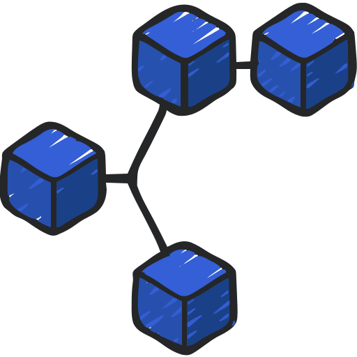

<div align="center">



# chankit

### *Elegant, Type-Safe Channel Operations for Go*

Transform the way you work with Go channels using modern, composable pipelines

[](https://goreportcard.com/report/github.com/utkarsh5026/chankit)
[](https://godoc.org/github.com/utkarsh5026/chankit)
[](https://opensource.org/licenses/MIT)

[Features](#-features) • [Installation](#-installation) • [Quick Start](#-quick-start) • [Examples](#-real-world-examples) • [API Reference](#-api-reference)

</div>

---

## 🎯 What is chankit?

**chankit** is a powerful Go library that brings functional programming patterns to Go channels. Built with generics for complete type safety, it transforms verbose channel operations into elegant, readable pipelines.

### From This...
```go
// Traditional Go: Verbose, nested, hard to maintain
ch := make(chan int)
go func() {
    for i := 1; i <= 100; i++ {
        ch <- i
    }
    close(ch)
}()

ch2 := make(chan int)
go func() {
    defer close(ch2)
    for v := range ch {
        ch2 <- v * v
    }
}()

result := []int{}
for v := range ch2 {
    if v%2 == 0 {
        result = append(result, v)
    }
}
```

### ...To This!
```go
// chankit: Clean, expressive, maintainable
result := chankit.RangePipeline(ctx, 1, 101, 1).
    Map(func(x int) any { return x * x }).
    Filter(func(x any) bool { return x.(int)%2 == 0 }).
    ToSlice()
```

---

## ✨ Features

<table>
<tr>
<td width="50%" valign="top">

### 🎛️ **Flow Control**
Control the flow of data with powerful timing operators
- **Throttle** - Rate limiting with value dropping
- **Debounce** - Wait for silence before emitting
- **Batch** - Group values by size or timeout
- **FixedInterval** - Consistent value pacing

### 🔄 **Transformations**
Transform and process data functionally
- **Map** - Transform values with type safety
- **Filter** - Select values by predicate
- **Reduce** - Aggregate to single result
- **FlatMap** - Transform and flatten

</td>
<td width="50%" valign="top">

### 🏭 **Generators**
Create channels from various sources
- **Range** - Numeric sequences
- **Generate** - Custom generator functions
- **Repeat** - Infinite value repetition
- **FromSlice** - Convert slices to channels

### ⚡ **Production Ready**
Built for real-world use
- **Context-Aware** - Respects cancellation
- **Type-Safe** - Full generic support
- **Well-Tested** - Comprehensive coverage
- **Pipeline API** - Modern fluent interface

</td>
</tr>
</table>

---

## 📦 Installation

```bash
go get github.com/utkarsh5026/chankit
```

```go
import "github.com/utkarsh5026/chankit/chankit"
```

---

## 🚀 Quick Start

### The Pipeline Pattern

```go
package main

import (
    "context"
    "fmt"
    "github.com/utkarsh5026/chankit/chankit"
)

func main() {
    ctx := context.Background()

    // Create a pipeline: numbers 1-100, square them, keep evens, take first 10
    result := chankit.RangePipeline(ctx, 1, 101, 1).
        Map(func(x int) any { return x * x }).
        Filter(func(x any) bool { return x.(int)%2 == 0 }).
        Take(10).
        ToSlice()

    fmt.Println(result)
    // Output: [4 16 36 64 100 144 196 256 324 400]
}
```

---

## 💡 Real-World Examples

### 📊 Example 1: Data Processing Pipeline

**Scenario:** Process a stream of numbers - square them, filter for even results, skip the first 10, and take the next 20.

```go
package main

import (
    "context"
    "fmt"
    "github.com/utkarsh5026/chankit/chankit"
)

func main() {
    ctx := context.Background()

    // Process numbers 1-100
    result := chankit.RangePipeline(ctx, 1, 101, 1).
        Map(func(x int) any { return x * x }).           // Square each number
        Filter(func(x any) bool {                         // Keep only even squares
            return x.(int)%2 == 0
        }).
        Skip(10).                                         // Skip first 10 results
        Take(20).                                         // Take next 20
        ToSlice()                                         // Collect to slice

    fmt.Printf("Processed %d values: %v\n", len(result), result)
}
```

**Output:**
```
Processed 20 values: [484 576 676 784 900 1024 1156 1296 1444 1600 1764 1936 2116 2304 2500 2704 2916 3136 3364 3600]
```

---

### 🔄 Example 2: Event Stream Processing

**Scenario:** Build a real-time event processing system that debounces user input, filters events, and batches them for processing.

```go
package main

import (
    "context"
    "fmt"
    "time"
    "github.com/utkarsh5026/chankit/chankit"
)

type Event struct {
    Type      string
    Timestamp time.Time
    Data      string
}

func main() {
    ctx := context.Background()

    // Simulate event stream
    events := make(chan Event, 100)
    go func() {
        defer close(events)
        for i := 0; i < 50; i++ {
            events <- Event{
                Type:      "click",
                Timestamp: time.Now(),
                Data:      fmt.Sprintf("event-%d", i),
            }
            time.Sleep(10 * time.Millisecond)
        }
    }()

    // Process events: debounce, filter, and batch
    batches := chankit.From(ctx, events).
        Debounce(50 * time.Millisecond).                  // Wait for 50ms silence
        Filter(func(e Event) bool {                       // Filter specific events
            return e.Type == "click"
        }).
        Batch(5, 200*time.Millisecond)                    // Batch 5 or every 200ms

    // Process batches
    for batch := range batches {
        fmt.Printf("Processing batch of %d events\n", len(batch))
    }
}
```

---

### 🔀 Example 3: Data Transformation Stream

**Scenario:** Transform user data by filtering active users, extracting emails, and processing in batches.

```go
package main

import (
    "context"
    "fmt"
    "strings"
    "time"
    "github.com/utkarsh5026/chankit/chankit"
)

type User struct {
    ID     int
    Name   string
    Email  string
    Active bool
}

func main() {
    ctx := context.Background()

    // Sample users
    users := []User{
        {1, "Alice", "alice@example.com", true},
        {2, "Bob", "bob@example.com", false},
        {3, "Charlie", "charlie@example.com", true},
        {4, "Diana", "diana@example.com", true},
        {5, "Eve", "eve@example.com", false},
    }

    // Transform: active users → emails → uppercase → batch
    batches := chankit.FromSlice(ctx, users).
        Filter(func(u User) bool { return u.Active }).    // Active users only
        Map(func(u User) any { return u.Email }).         // Extract emails
        Map(func(e any) any {                             // Uppercase emails
            return strings.ToUpper(e.(string))
        }).
        Batch(2, 100*time.Millisecond)                    // Batch for processing

    // Process email batches
    for batch := range batches {
        fmt.Printf("Email batch: %v\n", batch)
    }
    // Output:
    // Email batch: [ALICE@EXAMPLE.COM CHARLIE@EXAMPLE.COM]
    // Email batch: [DIANA@EXAMPLE.COM]
}
```

---

### 📈 Example 4: Real-Time Sensor Data Analytics

**Scenario:** Process high-frequency sensor readings, debounce them to reduce noise, transform values, and calculate running averages.

```go
package main

import (
    "context"
    "fmt"
    "math/rand"
    "time"
    "github.com/utkarsh5026/chankit/chankit"
)

type SensorReading struct {
    SensorID  string
    Value     float64
    Timestamp time.Time
}

func main() {
    ctx, cancel := context.WithTimeout(context.Background(), 2*time.Second)
    defer cancel()

    // Simulate sensor data stream
    readings := make(chan SensorReading, 100)
    go func() {
        defer close(readings)
        for {
            select {
            case <-ctx.Done():
                return
            case readings <- SensorReading{
                SensorID:  "temp-01",
                Value:     20 + rand.Float64()*10,
                Timestamp: time.Now(),
            }:
                time.Sleep(10 * time.Millisecond)
            }
        }
    }()

    // Process: debounce → transform to Celsius → calculate average
    processed := chankit.From(ctx, readings).
        Debounce(100 * time.Millisecond).                 // Reduce noise
        Map(func(r SensorReading) any {                   // Transform value
            return r.Value * 1.5 // Simulate transformation
        }).
        Take(10)                                          // Take first 10

    // Calculate average
    sum := 0.0
    count := 0
    processed.ForEach(func(v any) {
        sum += v.(float64)
        count++
        fmt.Printf("Reading #%d: %.2f\n", count, v.(float64))
    })

    if count > 0 {
        fmt.Printf("\nAverage: %.2f\n", sum/float64(count))
    }
}
```

---

### 🔍 Example 5: Search-As-You-Type with Debouncing

**Scenario:** Implement an efficient search system that waits for the user to stop typing before executing the search.

```go
package main

import (
    "context"
    "fmt"
    "strings"
    "time"
    "github.com/utkarsh5026/chankit/chankit"
)

func performSearch(query string) []string {
    // Simulate search results
    database := []string{"apple", "application", "apply", "banana", "band", "bandana"}
    results := []string{}
    for _, item := range database {
        if strings.Contains(strings.ToLower(item), strings.ToLower(query)) {
            results = append(results, item)
        }
    }
    return results
}

func main() {
    ctx := context.Background()

    // Simulate user typing
    userInput := make(chan string, 10)
    go func() {
        defer close(userInput)
        queries := []string{"a", "ap", "app", "appl", "apple"}
        for _, q := range queries {
            userInput <- q
            time.Sleep(50 * time.Millisecond)
        }
    }()

    // Debounce and search
    results := chankit.From(ctx, userInput).
        Debounce(200 * time.Millisecond).                 // Wait for typing to stop
        Filter(func(q string) bool { return len(q) >= 2 }).// Min 2 chars
        Map(func(q string) any {                          // Perform search
            fmt.Printf("Searching for: %s\n", q)
            return performSearch(q)
        })

    // Display results
    results.ForEach(func(r any) {
        fmt.Printf("Results: %v\n", r)
    })
}
```

---

### ⚡ Example 6: Rate-Limited API Calls

**Scenario:** Make API calls at a controlled rate to avoid hitting rate limits.

```go
package main

import (
    "context"
    "fmt"
    "time"
    "github.com/utkarsh5026/chankit/chankit"
)

type APIRequest struct {
    ID       int
    Endpoint string
}

func callAPI(req APIRequest) string {
    // Simulate API call
    return fmt.Sprintf("Response for request %d", req.ID)
}

func main() {
    ctx := context.Background()

    // Create 20 API requests
    requests := make([]APIRequest, 20)
    for i := 0; i < 20; i++ {
        requests[i] = APIRequest{
            ID:       i + 1,
            Endpoint: "/api/data",
        }
    }

    // Process at most 10 requests per second (100ms interval)
    fmt.Println("Making rate-limited API calls...")
    start := time.Now()

    chankit.FromSlice(ctx, requests).
        FixedInterval(100 * time.Millisecond).            // 10 per second max
        Tap(func(req APIRequest) {                        // Log progress
            fmt.Printf("[%s] Processing request %d\n",
                time.Since(start).Round(time.Millisecond), req.ID)
        }).
        Map(func(req APIRequest) any {                    // Make API call
            return callAPI(req)
        }).
        ForEach(func(resp any) {                          // Handle responses
            // Process response
        })

    fmt.Printf("Completed in %s\n", time.Since(start).Round(time.Millisecond))
}
```

---

## 📚 API Reference

### 🔨 Creating Pipelines

| Method | Description | Example |
|--------|-------------|---------|
| `RangePipeline(ctx, start, end, step)` | Create from numeric range | `RangePipeline(ctx, 1, 100, 1)` |
| `FromSlice(ctx, slice)` | Create from slice | `FromSlice(ctx, []int{1,2,3})` |
| `From(ctx, channel)` | Create from existing channel | `From(ctx, myChan)` |
| `NewPipeline[T](ctx)` | Create empty pipeline | `NewPipeline[int](ctx)` |

### 🔄 Transformation Methods

| Method | Description | Example |
|--------|-------------|---------|
| `Map(fn)` | Transform each value | `.Map(func(x int) any { return x * 2 })` |
| `MapTo[R](fn)` | Type-safe map | `MapTo(p, func(x int) string { ... })` |
| `Filter(fn)` | Keep matching values | `.Filter(func(x int) bool { return x > 10 })` |
| `FlatMap(fn)` | Transform and flatten | `.FlatMap(func(x int) <-chan int { ... })` |

### 🎯 Selection Methods

| Method | Description | Example |
|--------|-------------|---------|
| `Take(n)` | Take first N values | `.Take(10)` |
| `Skip(n)` | Skip first N values | `.Skip(5)` |
| `TakeWhile(fn)` | Take while predicate true | `.TakeWhile(func(x int) bool { return x < 100 })` |
| `SkipWhile(fn)` | Skip while predicate true | `.SkipWhile(func(x int) bool { return x < 0 })` |
| `First()` | Get first value | `value, ok := pipeline.First()` |
| `Last()` | Get last value | `value, ok := pipeline.Last()` |

### 🎛️ Flow Control Methods

| Method | Description | Use Case | Example |
|--------|-------------|----------|---------|
| `Throttle(duration)` | Emit at fixed intervals, drop extras | UI updates, high-frequency events | `.Throttle(100*time.Millisecond)` |
| `Debounce(duration)` | Wait for silence before emitting | Search boxes, form validation | `.Debounce(300*time.Millisecond)` |
| `FixedInterval(duration)` | Pace values without dropping | Rate-limited API calls | `.FixedInterval(100*time.Millisecond)` |
| `Batch(size, timeout)` | Group into batches | Bulk database inserts | `.Batch(100, 5*time.Second)` |

### 🔀 Combining Pipelines

| Method | Description | Example |
|--------|-------------|---------|
| `Merge(channels...)` | Combine multiple channels | `p1.Merge(p2.Chan(), p3.Chan())` |
| `ZipWith(other)` | Pair values from two channels | `ZipWith(p1, p2.Chan())` |

### 🏁 Terminal Operations

| Method | Description | Blocking | Example |
|--------|-------------|----------|---------|
| `ToSlice()` | Collect all values | Yes | `result := pipeline.ToSlice()` |
| `Reduce(fn, initial)` | Aggregate values | Yes | `.Reduce(func(a,b int) int { return a+b }, 0)` |
| `Count()` | Count values | Yes | `count := pipeline.Count()` |
| `ForEach(fn)` | Execute for each | Yes | `.ForEach(func(x int) { fmt.Println(x) })` |
| `Any(fn)` | Check if any match | Yes | `.Any(func(x int) bool { return x > 10 })` |
| `All(fn)` | Check if all match | Yes | `.All(func(x int) bool { return x > 0 })` |
| `Chan()` | Get underlying channel | No | `ch := pipeline.Chan()` |

### 👁️ Observation Methods

| Method | Description | Example |
|--------|-------------|---------|
| `Tap(fn)` | Observe without modifying | `.Tap(func(x int) { log.Println(x) })` |

---

## 🎨 Advanced Patterns

### Pattern 1: Complex Data Pipeline

```go
// Multi-stage data processing with logging
result := chankit.RangePipeline(ctx, 1, 1000, 1).
    Tap(func(x int) { log.Printf("Input: %d", x) }).
    Filter(func(x int) bool { return x%2 == 0 }).
    Tap(func(x int) { log.Printf("After filter: %d", x) }).
    Map(func(x int) any { return x * x }).
    Skip(10).
    Take(20).
    Tap(func(x any) { log.Printf("Final: %v", x) }).
    ToSlice()
```

### Pattern 2: Fan-Out/Fan-In

```go
// Process data through multiple parallel pipelines
ctx := context.Background()
source := chankit.RangePipeline(ctx, 1, 100, 1)

// Fan-out: multiple processing pipelines
evens := source.Filter(func(x int) bool { return x%2 == 0 })
odds := source.Filter(func(x int) bool { return x%2 != 0 })

// Fan-in: merge results
merged := evens.Merge(odds.Chan())
result := merged.ToSlice()
```

### Pattern 3: Conditional Processing

```go
// Different processing based on value
result := chankit.FromSlice(ctx, data).
    Map(func(x int) any {
        if x > 100 {
            return x * 2
        } else if x > 50 {
            return x * 1.5
        }
        return x
    }).
    ToSlice()
```

---

## 🛑 Context Cancellation

All operations respect context cancellation for graceful shutdowns:

```go
// Timeout after 5 seconds
ctx, cancel := context.WithTimeout(context.Background(), 5*time.Second)
defer cancel()

result := chankit.RangePipeline(ctx, 1, 1000000, 1).
    Map(func(x int) any { return expensiveOperation(x) }).
    ToSlice() // Stops after 5 seconds

// Manual cancellation
ctx, cancel := context.WithCancel(context.Background())
go func() {
    time.Sleep(1 * time.Second)
    cancel() // Stop all operations
}()

pipeline := chankit.From(ctx, channel).
    Map(func(x int) any { return process(x) })
```

---

## ⚙️ Configuration & Performance

### Buffering

Control channel buffer sizes for better performance:

```go
// Custom buffer size for high-throughput
ch := chankit.Map(ctx, input, fn, chankit.WithBuffer[int](100))

// Auto-sized buffer for SliceToChan
ch := chankit.SliceToChan(ctx, slice, chankit.WithBufferAuto[int]())
```

### Pre-allocation

Optimize memory when collecting:

```go
// Pre-allocate if you know the size
slice := chankit.ChanToSlice(ctx, ch, chankit.WithCapacity[int](1000))
```

### Performance Tips

1. **Use buffered channels** for high-throughput scenarios
2. **Pre-allocate slices** when you know the expected size
3. **Choose the right flow control**:
   - `Throttle` - Drop values for rate limiting
   - `Debounce` - Wait for activity to stop
   - `FixedInterval` - Preserve all values
   - `Batch` - Group for bulk operations

---

## 🧪 Testing

```bash
# Run all tests
go test ./...

# Run with coverage
go test -cover ./...

# Run specific test
go test -v -run TestThrottle ./chankit

# Benchmark
go test -bench=. ./chankit
```

---

## 📊 Why chankit?

<table>
<tr>
<td width="50%" valign="top">

### ❌ Standard Library
```go
// Verbose, error-prone
ch := make(chan int)
go func() {
    defer close(ch)
    for i := 0; i < 10; i++ {
        ch <- i * 2
    }
}()

result := []int{}
for v := range ch {
    if v%4 == 0 {
        result = append(result, v)
    }
}
```

**Issues:**
- Manual goroutine management
- Error-prone close handling
- Hard to compose operations
- No context support built-in
- Verbose and repetitive

</td>
<td width="50%" valign="top">

### ✅ chankit
```go
// Clean, declarative
result := chankit.RangePipeline(ctx, 0, 10, 1).
    Map(func(x int) any { return x * 2 }).
    Filter(func(x any) bool {
        return x.(int)%4 == 0
    }).
    ToSlice()
```

**Advantages:**
- Declarative, readable code
- Automatic resource management
- Easy composition and chaining
- Built-in context support
- Type-safe with generics
- Production-tested patterns

</td>
</tr>
</table>

### Key Benefits

- **Higher-level abstractions** - Map, Filter, Reduce for functional programming
- **Flow control utilities** - Throttle, Debounce, Batch for common patterns
- **Type-safe generics** - Compile-time type checking
- **Composability** - Easy chaining for complex pipelines
- **Production-tested** - Comprehensive test coverage

---

## 🤝 Contributing

Contributions are welcome! Please feel free to submit a Pull Request.

1. Fork the repository
2. Create your feature branch (`git checkout -b feature/amazing-feature`)
3. Commit your changes (`git commit -m 'Add amazing feature'`)
4. Push to the branch (`git push origin feature/amazing-feature`)
5. Open a Pull Request

---

## 📄 License

MIT License - see [LICENSE](LICENSE) file for details.

---

<div align="center">

### Made with ❤️ for the Go community

**[⭐ Star this repo](https://github.com/utkarsh5026/chankit)** if you find it useful!

---

*chankit - Transform channels, elevate code*

</div>
